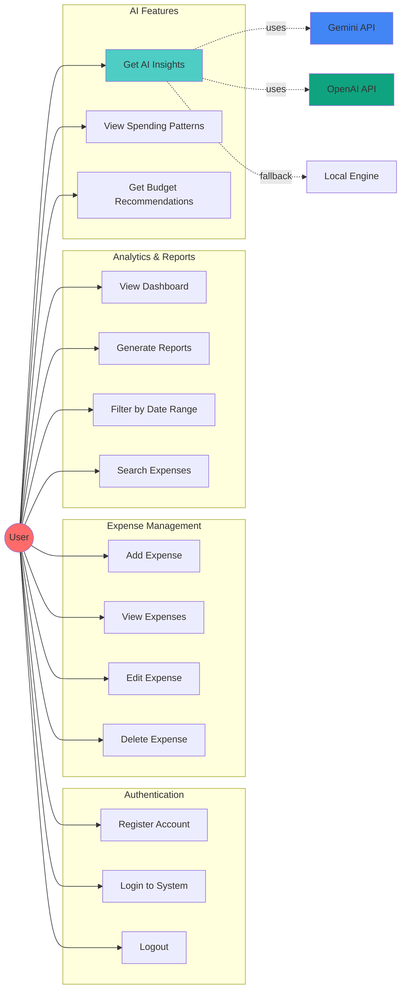
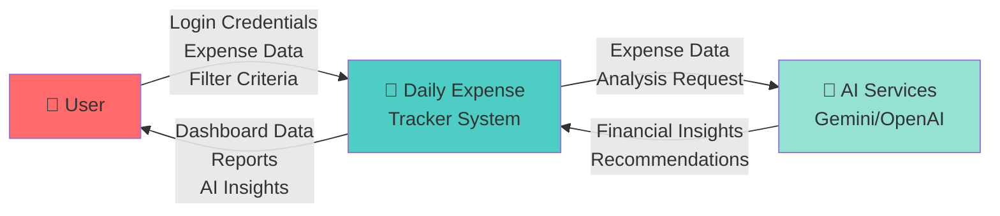
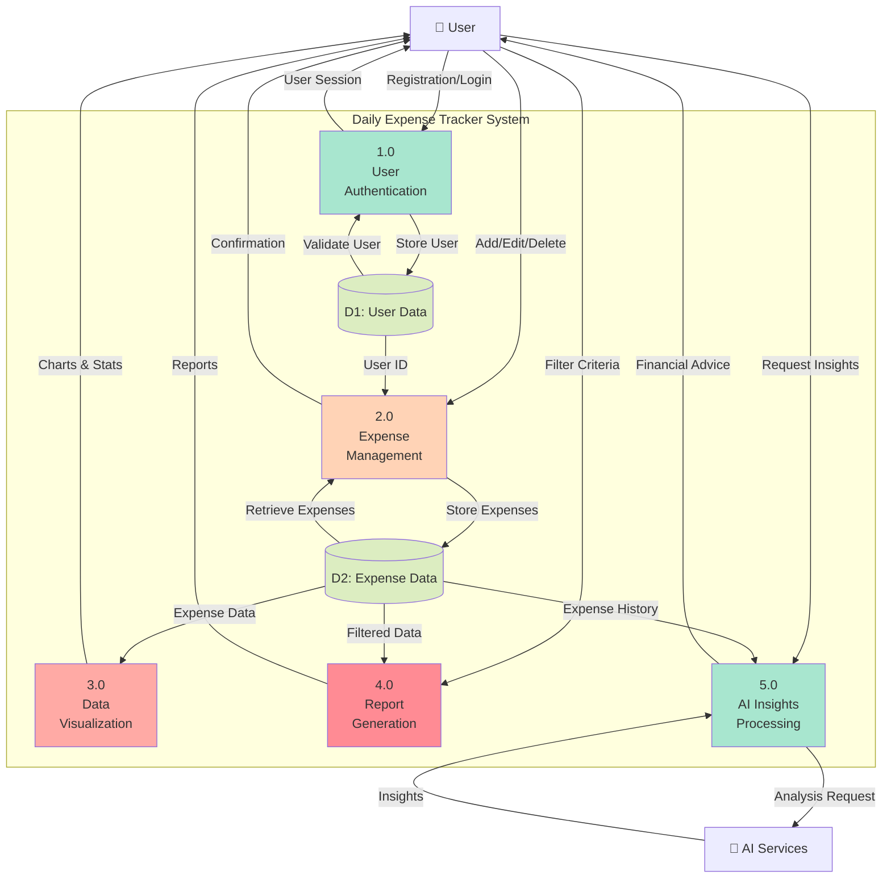
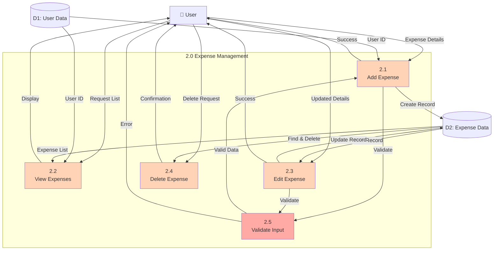
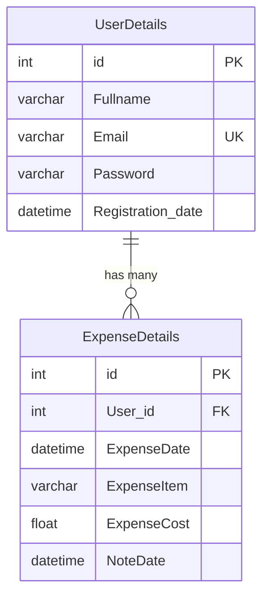
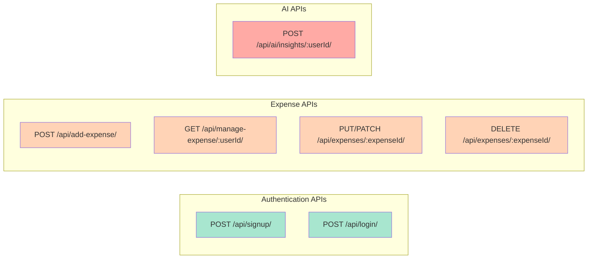

# 💰 Daily Expense Tracker

A comprehensive full-stack web application for personal finance management with AI-powered insights.

## 📋 Table of Contents
- [Overview](#overview)
- [System Architecture](#system-architecture)
- [Use Case Diagram](#use-case-diagram)
- [Data Flow Diagram](#data-flow-diagram)
- [Database Schema](#database-schema)
- [Technology Stack](#technology-stack)
- [Setup Instructions](#setup-instructions)
- [API Endpoints](#api-endpoints)

---

## 🎯 Overview

Daily Expense Tracker is a modern web application that helps users track their daily expenses, visualize spending patterns, and receive AI-powered financial insights for better money management.

### Key Features
- 👤 User Authentication (Signup/Login)
- 💵 Expense Management (Add, Edit, Delete)
- 📊 Interactive Dashboard with Charts
- 📈 Advanced Expense Reports with Filtering
- 🤖 AI-Powered Financial Insights (Gemini & OpenAI)
- 📱 Responsive Design

---

## 🏗️ System Architecture

```mermaid
graph TB
    subgraph "Frontend - React Application"
        A[React Components]
        B[React Router]
        C[Chart.js Visualization]
        D[LocalStorage]
    end
    
    subgraph "Backend - Django API"
        E[Django Views]
        F[Django Models]
        G[URL Routing]
    end
    
    subgraph "Database"
        H[(SQLite Database)]
    end
    
    subgraph "AI Services"
        I[Google Gemini API]
        J[OpenAI API]
        K[Fallback Engine]
    end
    
    A -->|HTTP Requests| E
    E -->|Query/Save| F
    F -->|ORM| H
    B -->|Route Management| A
    C -->|Render Charts| A
    A -->|Store Session| D
    E -->|AI Insights Request| I
    E -->|AI Insights Request| J
    E -->|Local Processing| K
    
    style A fill:#61dafb
    style E fill:#092e20
    style H fill:#003b57
    style I fill:#4285f4
    style J fill:#10a37f
```



### Architecture Layers

**Frontend Layer (React + Vite)**
- Component-based architecture
- Client-side routing with React Router
- State management using React Hooks
- Real-time data visualization with Chart.js

**Backend Layer (Django REST)**
- RESTful API design
- MVT pattern implementation
- CSRF protection & CORS handling
- Business logic layer

**Data Layer (SQLite)**
- Relational database with foreign key constraints
- User and Expense entities
- Automatic timestamp management

**AI Integration Layer**
- Multi-provider support (Gemini, OpenAI)
- Intelligent fallback mechanism
- Quota management

---

## 👥 Use Case Diagram



### Use Case Descriptions

**Authentication Use Cases:**
- **Register Account**: New users create accounts with fullname, email, and password
- **Login**: Existing users authenticate using email and password
- **Logout**: Users end their session and clear local storage

**Expense Management Use Cases:**
- **Add Expense**: Record new expenses with item name, cost, and date
- **View Expenses**: Display all user expenses in list/table format
- **Edit Expense**: Modify existing expense details
- **Delete Expense**: Remove unwanted expense records

**Analytics & Reports Use Cases:**
- **View Dashboard**: See overview with charts, totals, and recent expenses
- **Generate Reports**: Create comprehensive expense reports
- **Filter by Date Range**: View expenses within specific date ranges
- **Search Expenses**: Find expenses by item name

**AI Features Use Cases:**
- **Get AI Insights**: Request AI-powered spending analysis
- **View Spending Patterns**: Identify spending trends and categories
- **Get Budget Recommendations**: Receive personalized savings suggestions

---

## 🔄 Data Flow Diagram

### Level 0 - Context Diagram



### Level 1 - Process Diagram



### Level 2 - Expense Management Detail



---

## 🗃️ Database Schema



### Entity Descriptions

**UserDetails Table**
- Stores user account information
- Email is unique for authentication
- Registration date auto-generated
- Cascade delete on user removal

**ExpenseDetails Table**
- Stores individual expense records
- Foreign key relationship to UserDetails
- Auto-generated timestamps (ExpenseDate, NoteDate)
- Supports flexible expense item naming

---

## 🛠️ Technology Stack

### Frontend
```
├── React 19.2.0                  # UI Framework
├── Vite (rolldown-vite 7.2.2)   # Build Tool
├── React Router DOM 7.9.1        # Routing
├── Chart.js 4.5.1                # Data Visualization
├── React-chartjs-2 5.3.1         # React wrapper for Chart.js
├── Bootstrap 5.3.8               # CSS Framework
└── React-Toastify 11.0.5         # Notifications
```

### Backend
```
├── Django 4.2.7                  # Web Framework
├── Django REST Framework 3.14.0  # API Framework
├── django-cors-headers 4.3.0     # CORS Support
├── SQLite                        # Database
├── OpenAI 1.54.0                 # AI Integration
├── Gunicorn 21.2.0              # WSGI Server
└── python-dotenv 1.0.0          # Environment Variables
```

---

## 🚀 Setup Instructions

### Backend Setup

```bash
# Navigate to backend directory
cd Backend

# Create virtual environment
python -m venv venv

# Activate virtual environment
# Windows:
venv\Scripts\activate
# Linux/Mac:
source venv/bin/activate

# Install dependencies
pip install -r requirements.txt

# Run migrations
python manage.py migrate

# Create superuser (optional)
python manage.py createsuperuser

# Run development server
python manage.py runserver
```

### Frontend Setup

```bash
# Navigate to frontend directory
cd frontend

# Install dependencies
npm install

# Run development server
npm run dev
```

### Environment Variables

Create a `.env` file in the Backend directory:

```env
# Optional: AI API Keys
GEMINI_API_KEY=your_gemini_api_key_here
OPENAI_API_KEY=your_openai_api_key_here
GEMINI_MODEL=gemini-2.5-flash  # Optional, defaults to gemini-2.5-flash
```

---

## 🔌 API Endpoints



### API Documentation

#### Authentication

**POST /api/signup/**
```json
Request: {
  "Fullname": "John Doe",
  "Email": "john@example.com",
  "Password": "password123"
}

Response: {
  "message": "User registered successfully"
}
```

**POST /api/login/**
```json
Request: {
  "Email": "john@example.com",
  "Password": "password123"
}

Response: {
  "message": "Login successful",
  "userId": 1,
  "userName": "John Doe",
  "userEmail": "john@example.com"
}
```

#### Expense Management

**POST /api/add-expense/**
```json
Request: {
  "UserId": 1,
  "ExpenseDate": "2025-12-17",
  "ExpenseItem": "Groceries",
  "ExpenseCost": 1500.00
}

Response: {
  "message": "Expense added successfully"
}
```

**GET /api/manage-expense/:userId/**
```json
Response: {
  "expenses": [
    {
      "id": 1,
      "ExpenseDate": "2025-12-17T10:30:00Z",
      "ExpenseItem": "Groceries",
      "ExpenseCost": 1500.00
    }
  ]
}
```

**PUT/PATCH /api/expenses/:expenseId/**
```json
Request: {
  "ExpenseItem": "Updated Item",
  "ExpenseCost": 2000.00
}

Response: {
  "message": "Expense updated successfully"
}
```

**DELETE /api/expenses/:expenseId/**
```json
Response: {
  "message": "Expense deleted successfully"
}
```

#### AI Insights

**POST /api/ai/insights/:userId/?provider=gemini**
```json
Response: {
  "insight": "Top spend categories -> Groceries: ₹5,000...",
  "provider": "gemini",
  "total_expenses": 15000.00,
  "average_expense": 1500.00,
  "expense_count": 10
}
```

---

## 📊 Component Structure

```
frontend/src/
├── components/
│   ├── home.jsx              # Landing page
│   ├── signup.jsx            # User registration
│   ├── login.jsx             # User login
│   ├── navbar.jsx            # Navigation bar
│   ├── dashboard.jsx         # Main dashboard with charts
│   ├── addexpense.jsx        # Add expense form
│   ├── manageexpense.jsx     # Expense list & management
│   ├── expensereport.jsx     # Advanced reporting
│   ├── AIInsights.jsx        # AI insights component
│   └── AIInsights.css        # AI component styles
├── App.jsx                   # Main app component
├── App.css                   # Global styles
├── main.jsx                  # Entry point
└── index.css                 # Base styles
```

---

## 🎨 Features Overview

### Dashboard
- 📊 Visual charts (Pie charts for spending distribution)
- 💰 Total expense calculation
- 📈 Average expense tracking
- 🔝 Highest expense highlight
- 📝 Recent transactions display

### Expense Reports
- 📅 Date range filtering
- 🔍 Search functionality
- 📊 Statistical summaries
- 📋 Detailed expense listing
- 💡 Export capabilities

### AI Insights
- 🤖 Multi-provider AI support (Gemini & OpenAI)
- 📊 Spending pattern analysis
- 💡 Personalized recommendations
- 📈 Budget optimization tips
- 🔄 Automatic fallback mechanism

---

## 🔐 Security Considerations

⚠️ **Current Implementation Notes:**
- Password storage: Plain text (requires hashing implementation)
- CSRF: Disabled for API endpoints
- CORS: Configured for development

🔒 **Production Recommendations:**
- Implement bcrypt/Argon2 password hashing
- Enable JWT token-based authentication
- Add rate limiting
- Enable CSRF protection
- Use environment-based configuration
- Implement HTTPS

---

## 📝 License

This project is licensed under the MIT License. See the LICENSE file for details.

Permissions: commercial use, modification, distribution, private use
Conditions: license and copyright notice
Limitations: liability, warranty

---

## 👨‍💻 Developer

Built with ❤️ by Soumik Das using React, Django, and AI technologies

---

## 🔗 Quick Links

- **Backend API**: `http://localhost:8000/api/`
- **Frontend**: `http://localhost:5173/`
- **Django Admin**: `http://localhost:8000/admin/`
